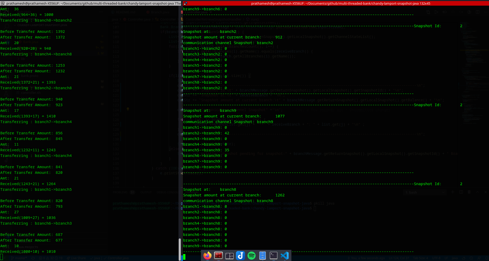

# Chandy-lamport-snapshot-java

Chandy Lamport algorithm for Global Snapshot of distributed banking systems.

## How to run

* Compile the code using:

  ```make```
* Create 9 bank branch that will randomly do the transactions with each other:

  ```bash ./branch.sh branch 9000 9```
* Start transaction in the server with the snapshot process begning at '9001'

  ```sh ./controller.sh 9001 branches.txt```

## How does it work

* Creates N different branches that will try to do transaction between each other in short interval of time.
* As the transactions are in the tansit and not commited it is important to take snapshot of not only the branch amount but also the communication channels.
* This project uses [Chandy lamport algorithm](https://https://en.wikipedia.org/wiki/Chandy%E2%80%93Lamport_algorithm) to take global snapshots such that in case of failure the state of the whole distributed system is maintained ( In this case total bank amount ).

## Screenshots

1. Start bank servers and snapshot controller:



2. Transactions in branches(left~~~~) with Global Snapshot(right):


